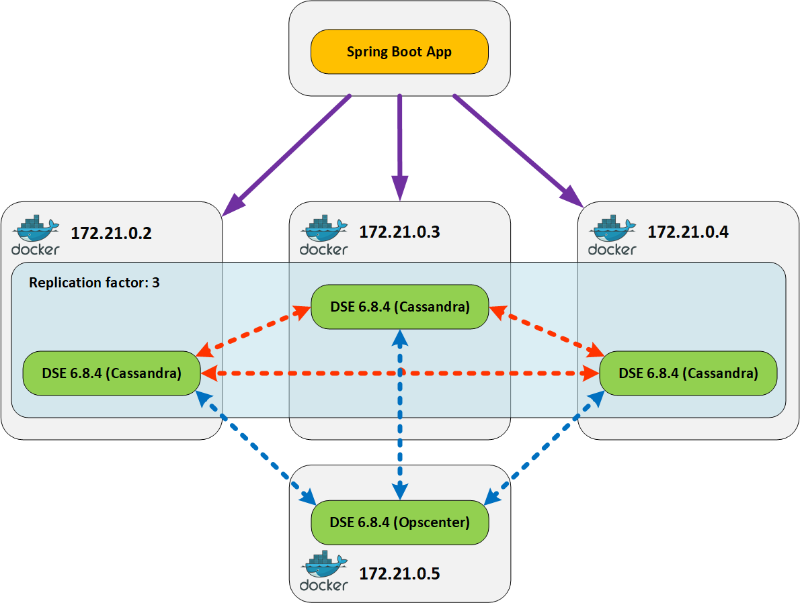

# apache-cassandra-workshop

Через `docker-compose up` поднимаются 4 контейнера: 3 контейнера содержат DataStax Enterprise 6.8.4 Cassandra, а один
DataStax Enterprise 6.8.4 Opscenter.

При запуске контейнера с именем `datastax-apache-cassandra1` выполняется создание keyspace `demo_app` и загрузка в таблицы
тестовых данных из csv-файлов.
Скрипты создания keyspace, csv-файлы и скрипт запуска Cassandra смотрите в каталоге `build.scripts/cassandra`.

Для доступа к консоли Opscenter используйте ссылку http://localhost:8888 или http://<адрес docker-machine>:8888, если
запускаете контейнеры через docker-machine.
При первом запуске необходимо выполнить следующие шаги:

1. Выберите **Manage existing cluster**.
2. На следующей странице указажите IP-адрес (172.21.0.2, 172.21.0.3, 172.21.0.4) хотя бы одного работающего экземпляра
Cassandra.
3. Выберите **Install agents manually**. Агент уже установлен в контейнеры `datastax-apache-cassandra1`,
`datastax-apache-cassandra2` и `datastax-apache-cassandra3`.

 

## Домашнее задание
* Найдите ошибку в реализации метода `com.github.peneksglazami.cassandra.demo.services.CassandraStorageService.updateUser`.
* Реализуйте метод `com.github.peneksglazami.cassandra.demo.services.CassandraStorageService.updateUserGroup`.
